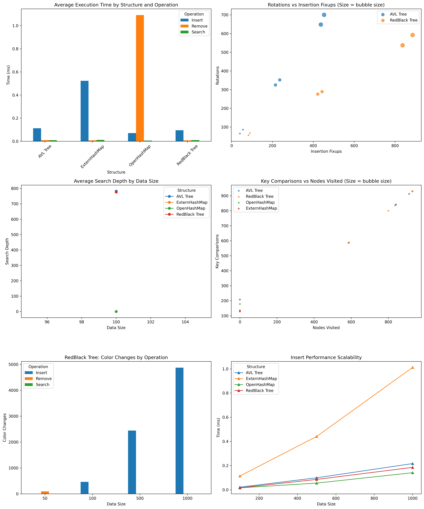
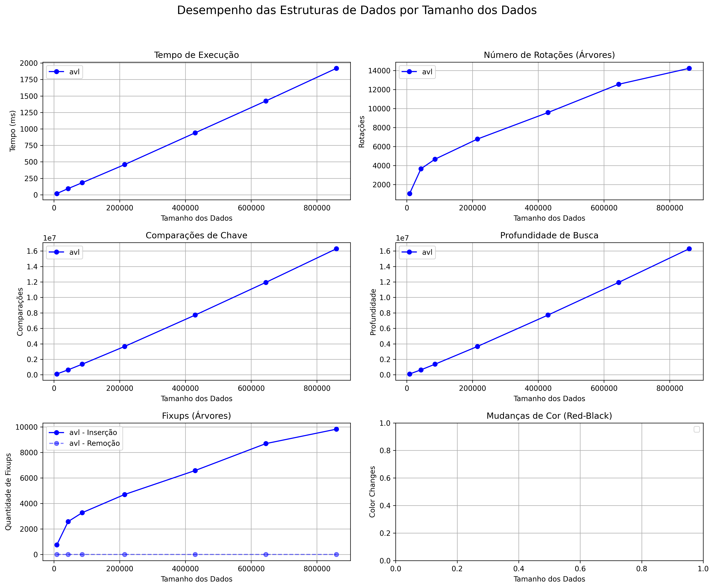

# Advanced Data Structures - Benchmark & Word Frequency

Este projeto implementa e analisa o desempenho de diferentes estruturas de dados em C++:

- 🌲 Árvores AVL
- 🌳 Árvores Rubro-Negras (Red-Black)
- 🧹 Tabelas de Espalhamento com Endereçamento Aberto (Open HashMap)
- 📦 Tabelas de Espalhamento com Acesso Externo (Extern HashMap)

---

## Funcionalidades

- 📊 **Benchmarks Automatizados**  
  Testes de desempenho para inserção, busca e remoção com diferentes tamanhos de dados.

- 📚 **Contagem de Frequência de Palavras**  
  Processamento de arquivos texto com suporte a Unicode (via ICU), contabilizando a frequência de cada palavra.

- 📈 **Análise e Visualização em Python**  
  Geração de gráficos de desempenho utilizando `pandas` e `matplotlib`.

---

## Estrutura do Projeto

```text
├── main.cpp                      # Execução da frequência de palavras
├── benchmark.cpp                 # Execução dos benchmarks
├── factory/
│   ├── makeStructury.cpp         # Fábrica das estruturas de dados
│   └── makeStructury.hpp
├── interfaces/                   # Interfaces e classes abstratas
├── structures/                   # Implementações das estruturas
│   ├── Trees/                    # Árvores AVL e Red-Black
│   └── Data/                     # Tabelas Hash
├── texto.txt                     # Arquivo de entrada exemplo
├── performance_results.csv       # Resultados dos benchmarks
├── freq_run_results.csv          # Resultados da execução de frequência
├── analyze_results_all_structures.py
├── analyze_results_dictionary.py
├── performance_plot.png          # Gráfico de benchmarks
└── README.md
```

---

## Requisitos

- **Compilador C++17**
- **Biblioteca ICU** (International Components for Unicode)
- **Python 3.10+**
- **Dependências Python:**
  - `matplotlib`
  - `pandas`

Instale o ambiente Python com:

```bash
python3 -m venv .venv
source .venv/bin/activate
pip install matplotlib pandas
```

Para compilar o projeto:

```bash
make
```

---

## Como Executar

### 🔍 Contagem de Frequência de Palavras

```bash
./maine freq <estrutura> <arquivo_texto>
```

**Exemplos:**

```bash
./maine freq avl texto.txt
./maine freq rb texto.txt
./maine freq open texto.txt
./maine freq extern texto.txt
```

O resultado da estrutura será impresso e os dados de desempenho serão salvos em:

```text
freq_run_results.csv
```

**Exemplo de saída:**

```text
        └───(vida, 2)
    ├───(terra, 3)
    │   └───(toda, 1)
Benchmark da execução freq salvo em freq_run_results.csv
```

---

### ⚙️ Benchmarks Automatizados

```bash
./maine --benchmark texto.txt
```

Testa automaticamente todas as estruturas com diferentes tamanhos de dados e salva os resultados em:

```text
freq_run_results.csv
```

---

## Visualização dos Resultados

Ative o ambiente virtual:

```bash
source .venv/bin/activate
```

### 📉 Visualização do Benchmark Geral:

```bash
.venv/bin/python3 analyze_results_all_structures.py freq_run_results.csv
```

### 📊 Visualização da Execução `freq`:

```bash
python analyze_results_dictionary.py freq_run_results.csv
```

Os gráficos serão exibidos ou salvos como `performance_overview.png`.

---

## Exemplos de Gráficos

### Benchmark Geral



### Execução de Frequência de Palavras



---

## Conclusões e Desafios Enfrentados

Durante o desenvolvimento deste projeto, vários desafios foram enfrentados e superados:

### 1. Interface Genérica para Estruturas

A criação da interface `DataStructure` exigiu um design flexível para suportar múltiplos tipos de dados (ex: `int`, `pair`, `tuple`).

Duas opções foram consideradas:

- Criar várias especializações da estrutura para cada tipo.
- Utilizar um `KeyExtractor` genérico (inspirado no `std::hash`) com SFINAE e `std::decay_t`.

Optamos pela segunda, com apoio do `decay_t` para extrair o tipo correto mesmo em containers como `vector<list<pair<string, int>>>`.

### 2. Leitura de Arquivos

Utilizamos `ifstream` para leitura e `ofstream` para escrita, facilitando a manipulação de arquivos de texto e a coleta de métricas.

### 3. Geração de Gráficos

A visualização dos dados foi delegada ao Python. Estruturamos os arquivos `.csv` para facilitar a geração automatizada dos gráficos via scripts.

### 4. PerformanceTracker

O rastreamento de desempenho foi implementado com contadores simples embutidos nas estruturas. Embora funcional, há espaço para melhorias com uma abordagem menos intrusiva e mais modular.

---

## Bibliografia:

1. https://en.cppreference.com/w/cpp/types/decay.html
2. https://www.geeksforgeeks.org/cpp/template-specialization-c/
3. https://www.geeksforgeeks.org/cpp/generics-in-c/
4. https://www.cs.usfca.edu/~galles/visualization/AVLtree.html
5. https://www.cs.usfca.edu/~galles/visualization/RedBlack.html
6. https://pt.wikipedia.org/wiki/%C3%81rvore_rubro-negra
7. https://walkccc.me/CLRS/Chap13/13.1/
8. https://en.wikipedia.org/wiki/Open_addressing
9. https://www.geeksforgeeks.org/cpp/cpp-program-to-create-an-interface/

---

## Créditos

Desenvolvido por **Luigy Gabriel**  
Universidade Federal do Ceará (UFC)
