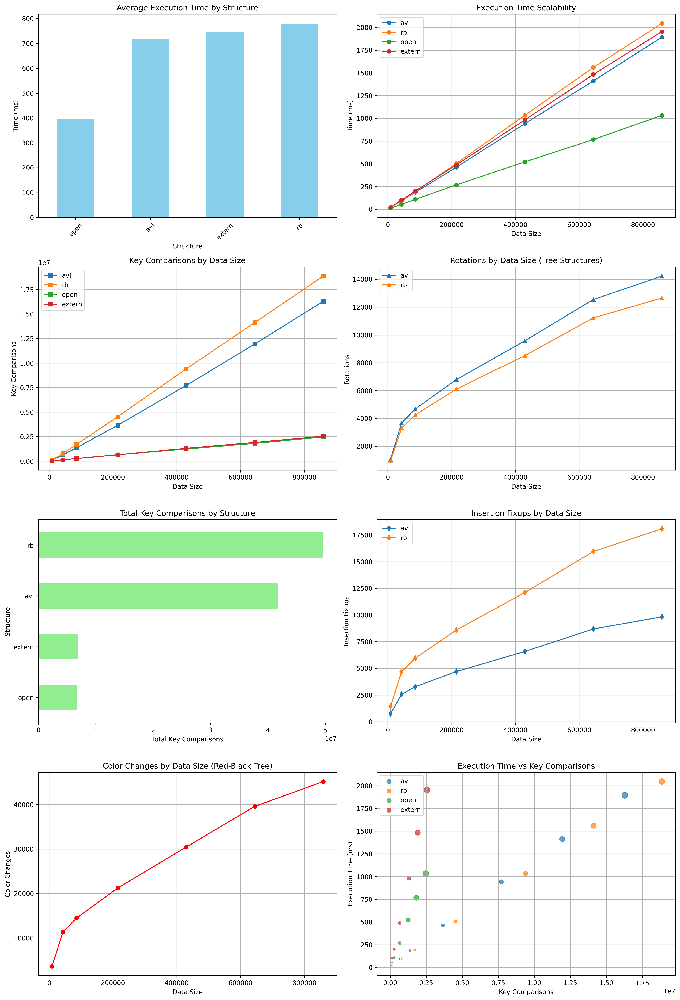

# Advanced Data Structures - Benchmark & Word Frequency

Este projeto implementa e analisa o desempenho de diferentes estruturas de dados em C++:

- Árvores AVL
- Árvores Rubro-Negras
- Tabelas de Espalhamento com Endereçamento Aberto (Open HashMap)
- Tabelas de Espalhamento com Acesso Externo (Extern HashMap)

O projeto realiza:

- Testes de benchmark automatizados (inserção, busca, remoção)
- Contagem de frequência de palavras de arquivos texto
- Análise e visualização dos dados via Python (matplotlib, pandas)

---

## Estrutura do Projeto

```text
├── main.cpp                    # Contagem de frequência de palavras
├── benchmark.cpp               # Executa benchmarks automatizados
├── factory/
│   ├── makeStructury.cpp       # Fábrica de estruturas de dados
│   └── makeStructury.hpp
├── interfaces/                # Interfaces genéricas para árvores/estruturas
├── structures/                # Implementações das estruturas
│   ├── Trees/
│   └── Data/
├── tests/                     # Testes unitários (opcional)
├── texto.txt                  # Arquivo de entrada exemplo
├── performance_results.csv    # Resultados dos benchmarks
├── freq_run_results.csv       # Resultado da execução via main
├── analyze_results_all_structures.py
├── analyze_results_dictionary.py
├── performance_plot.png       # Gráfico de benchmarks
├── README.md
```

---

## Requisitos

- **C++17**
- **ICU** (International Components for Unicode)
- **Python 3.10+**
- **Bibliotecas Python:** matplotlib, pandas

Instale com:

```bash
python3 -m venv .venv
source .venv/bin/activate
pip install matplotlib pandas
```

Para compilar:

```bash
make
```

---

## Execução da Frequência de Palavras

```bash
./maine freq <estrutura> <arquivo_texto>
```

**Exemplos:**

```bash
./maine freq avl texto.txt
./maine freq rb texto.txt
./maine freq open texto.txt
./maine freq extern texto.txt
```

Ao final, o resultado da estrutura é impresso e os dados de performance salvos em:

```text
freq_run_results.csv
```

### Exemplo de Saída

```bash
$ ./maine freq avl texto.txt
        ┌───(vida, 2)
    ┌───(terra, 3)
    │   └───(toda, 1)
...
Benchmark da execução freq salvo em freq_run_results.csv
```

---

## Execução dos Benchmarks (automáticos)

```bash
./benchmark texto.txt
```

Isso testará as estruturas com tamanhos de dados variados e salvará os resultados em:

```text
performance_results.csv
```

---

## Visualização dos Resultados (Python)

### Para visualizar os benchmarks gerais:

```bash
source .venv/bin/activate
python analyze_results_all_structures.py
```

### Para visualizar o resultado da execução `freq`:

```bash
source .venv/bin/activate
python analyze_results_dictionary.py
```

Isso irá gerar gráficos (salvos como `performance_plot.png` ou exibidos na tela).

---

## Exemplos de Gráficos

### Benchmark Geral


### Execução de Frequência de Palavras



---

## Créditos

Desenvolvido por Luigy Gabriel, Universidade Federal do Ceará (UFC)
